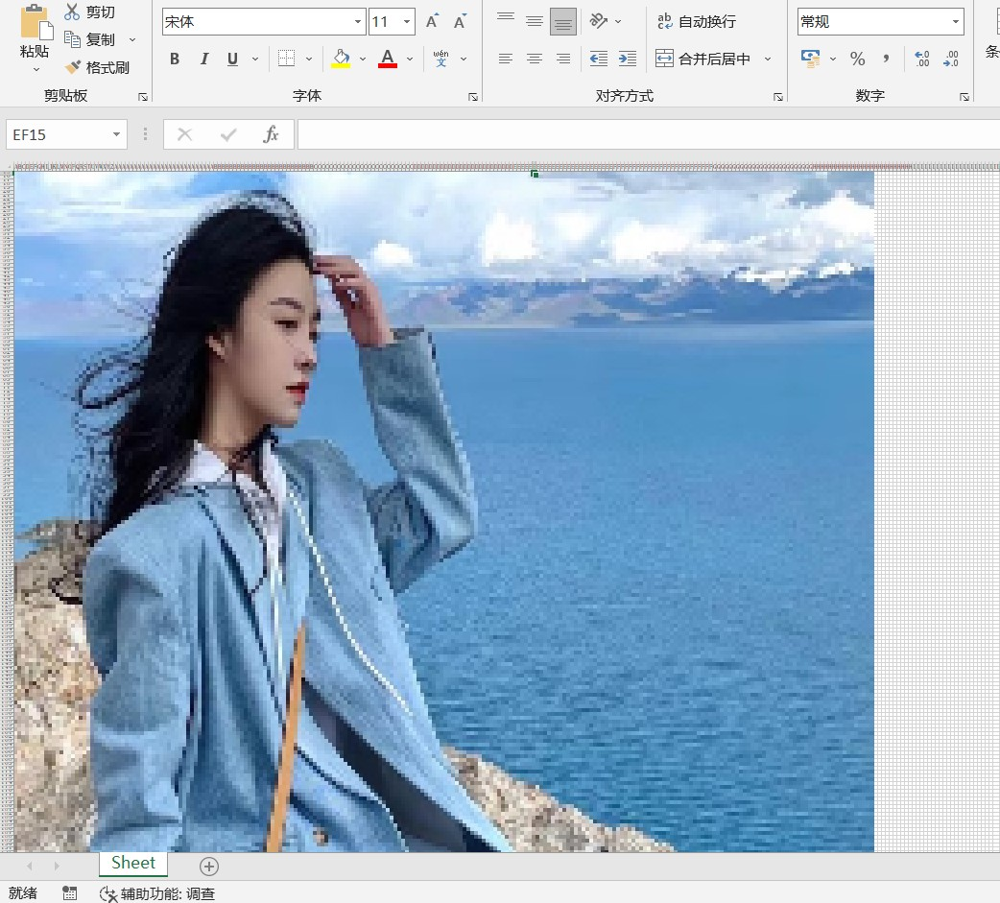

# 图片转表格
一个小小的工具，可以将图片分为N*N个像素点，逐一填充至表格的对应框中，当表格整体缩小时，即可得到一张图像

## 依赖
```
pip install -r requirements.txt
```

## 使用方法
* `python Image2xlsx\main.py -i example.jpg -o out.xlsx -s (224,224)`
* `-i`为`--image`，为图片路径；`-o`为`--output_name`，为输出表格名称；`-s`为`--shape`，为输出图片的大小，默认为224*224
* 打开表格，`Ctrl+A`选中所有表格，调整某一个表格的长宽比，推荐10*10像素，然后按住`Ctrl`，滚动鼠标缩小整个表格，保存即可

## 效果图
原图：  
  
转换结果:  
